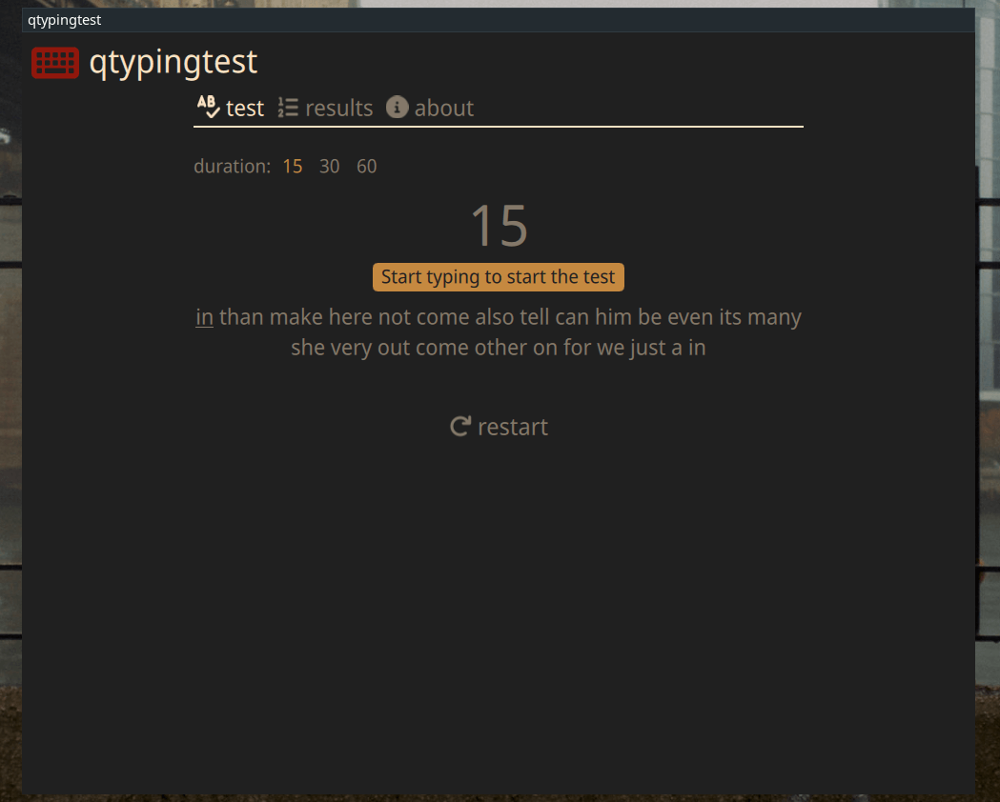
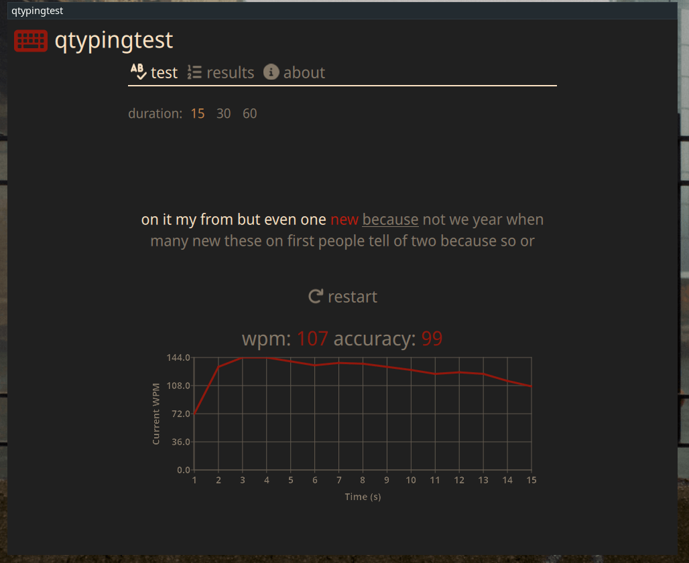
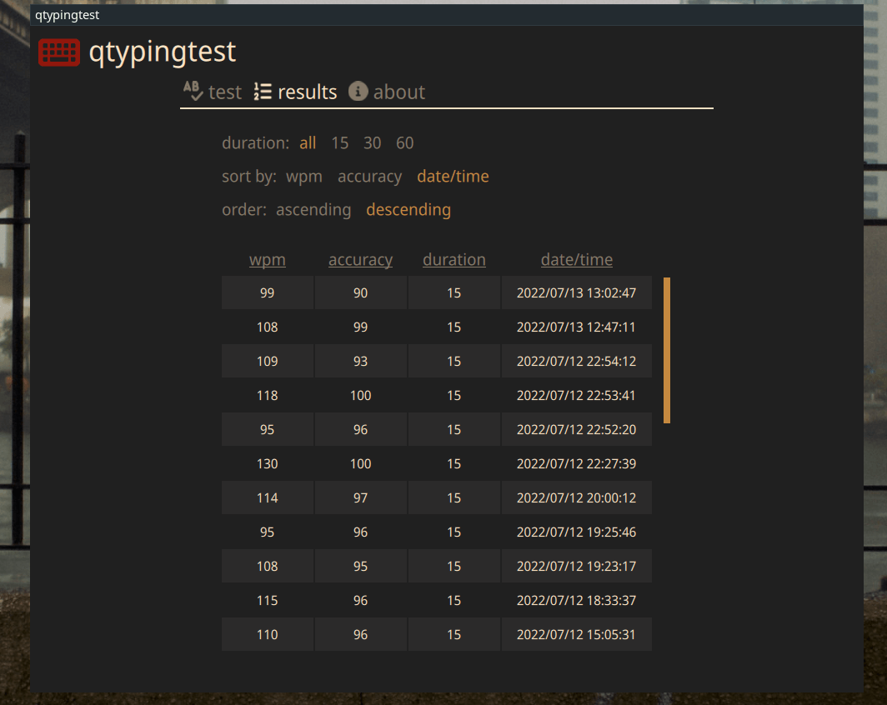

# qtypingtest
This is a typing test desktop application, made with Qt6/QtQuick and inspired by the [monkeytype.com](https://monkeytype.com) website.
The application was tested with Qt version 6.3.

# Screenshots




## Build and run

On any Linux distro or Windows:

1. Download Qt 6.3 with qml, qtquick and charts modules from the Qt website [https://www.qt.io/download-qt-installer](https://www.qt.io/download-qt-installer).

2. Open project file `qtypingtest.pro` in QtCreator and click Run.

On Arch Linux:

1. Install Qt deps and QtCreator.
```bash
$ sudo pacman -S qt6-base qt6-declarative qt6-charts qtcreator
```

2. Clone and build project:
```bash
$ git clone https://github.com/dbarac/qtypingtest.git
$ cd qtypingtest
$ mkdir build && cd build/
$ qmake6 -makefile
$ make -j
```

3. Run:
```bash
$ ./qtypingtest
```
